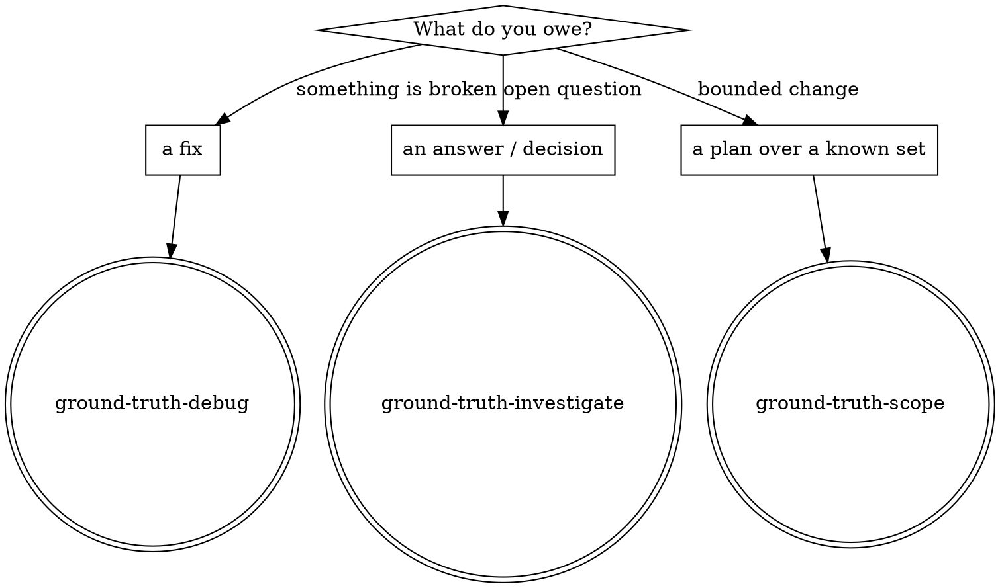

# Ground Truth

## Core principle

**Don't guess. Establish ground truth, then act on it.** Every confidently-wrong foundation — an inferred scope, an unreproduced bug, an unverified assumption — gets built on top of, and correcting it later invalidates the work above it.

**Violating the letter of this discipline is violating the spirit. No "I'm broadly following the pattern" exceptions.**

The ground rules (the cc-skills block in CLAUDE.md, installed by `/cc-skills:init`) apply to every track. This skill adds the routing.

## Route to the right track

Three task shapes hang off this spine. Pick by **what you owe** and **how ground truth is obtained**:

| You owe | Ground truth comes from | Use |
|---|---|---|
| a **fix** (observable wrong behavior, perf regression) | **reproducing the failure** — build a loop | **REQUIRED SUB-SKILL:** ground-truth-debug |
| an **answer / decision** (open question, "how/which/should we") | **researching** it, possibly fanning out agents | **REQUIRED SUB-SKILL:** ground-truth-investigate |
| a **plan over a known set** ("do X to these N things") | the user **handing it over as data** — don't infer the set | **REQUIRED SUB-SKILL:** ground-truth-scope |

**The tells:**
- *"Why is X failing / X is broken / X is slow"* → debug.
- *"How does X work / which approach / should we / what's affected (unknown)"* → investigate.
- *"Migrate / clean up / refactor / audit these things"* where you'd be tempted to enumerate the set yourself → scope.

If a task spans two (e.g. "investigate the bug then fix it"), do them in order as separate tracks — investigate/scope to ground truth, **stop**, then debug. Never fuse diagnosis with the plan or fix.
